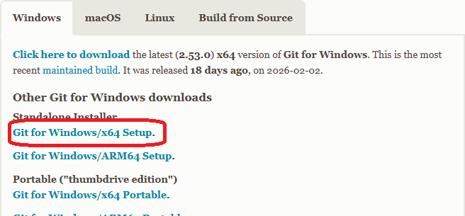
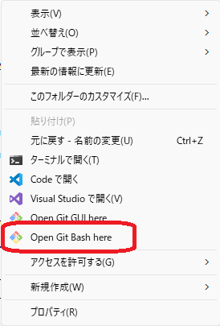
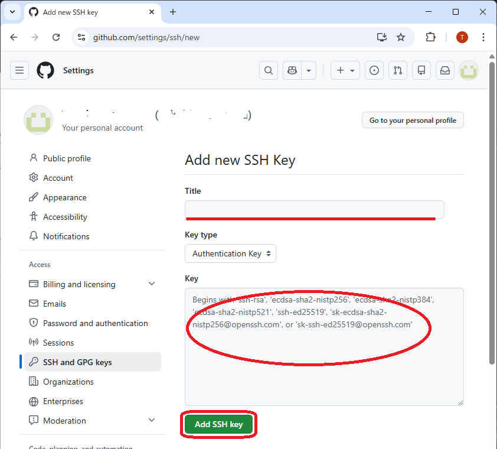
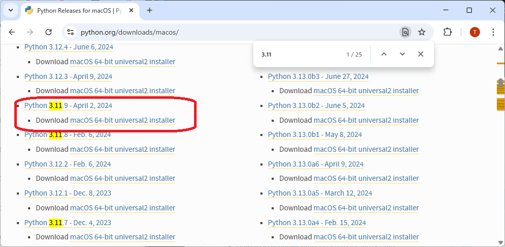
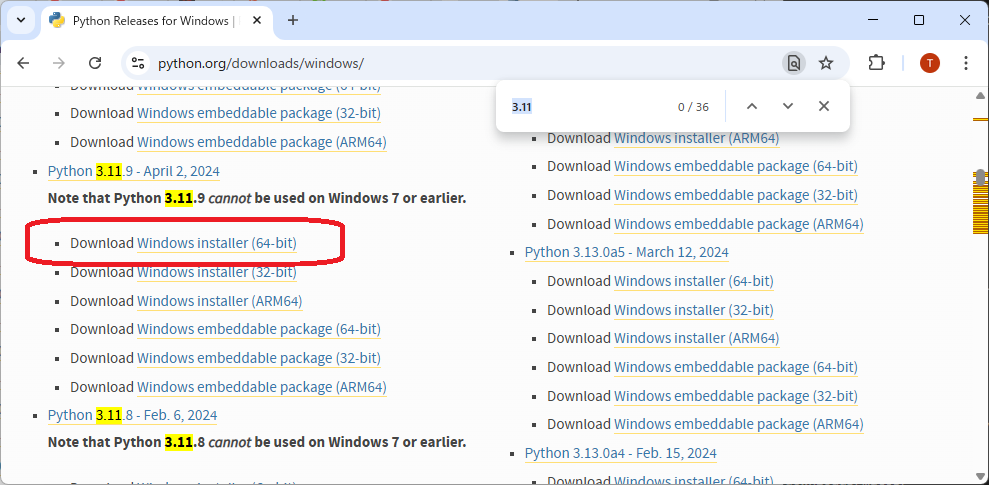

# 何が出来るようになる？

こんなサイトが **無料で** 作れます。

[https://DIZZY-DB.pages.dev/](https://DIZZY-DB.pages.dev/)

<br>

## 何をするサイトなの？

バンドの活動履歴アーカイブを公開出来ます。

* 参加イベント
* バンドメンバー
* セットリスト
* 対バン情報
* ライブハウス

の情報を入力して横断検索することが可能です。

オフィシャルアーカイブとしても、ファンサイトでも利用できるかと。

<br>

## どういう仕組み？

* python アプリで DB に情報を入力、json として出力します。
* git プロジェクトとして GitHub にコミット（アップロード）します。
* Cloudflare 経由で GitHub Pages を参照します。

なんだか難しそうですね。でも仕組みなんて気にしなくて良いです。

<br>

## 出来ないことは？

* サイト上やスマホでの情報更新は出来ません。

PCでDB更新 ⇒ json出力 ⇒ git add/commit/push　する必要があります。

なんだか難しそうですね。でも PC でこのページを見ているなら大丈夫です。

<br>

## サイトを閉じるには？

* Cloudflare アカウントを削除すればサイトを閉鎖出来ます
* GitHub アカウントを削除すればデータも削除されます
* 手元の PC に元データが残るだけになります　　←これが肝であり資産であり。無くすと最初の情報収集から。

<br><br>

# 🎸 環境構築マニュアル

このマニュアルでは、以下の作業を順番に行います。

1. Google アカウントを作る  
2. GitHub アカウントを作る
3. GitHub に空のリポジトリを作る  
4. Git をインストールする
5. Git の初期設定をする  
6. Python をインストールする  
7. プロジェクトフォルダを作る  
8. Git を初期化して GitHub に初回 push
9. GitHub Pages を公開する


<br><br>

# １－０．事前準備

工程をスムーズに進めるために準備しておきます。

<br>

### 1-0-1.考えておく事
|アカウント名|パスワード|生年月日|プロジェクト名|ニックネーム|
|---|---|---|---|---|
|karinomeado0101|karinop@ssw0rd|2000/01/01|BANDNAME|NICKNAME|

以下適宜読み替えて進めて下さい。

<br>

#### アカウント名

* アルファベット（a-z）、数字（0-9）、およびピリオド（.）のみが使用できます

#### パスワード

* Google アカウントで使います。忘れないように！

#### 生年月日

* 未成年（13歳以下）にしてしまうと Google アカウントがいちいち面倒になりますので注意！

#### プロジェクト名

* わりとおもてに出てくるかもしれないのでカコイイやつを

#### ニックネーム

* 内部的に１回しか使わないので割と適当

<BR>

### 1-0-2.構成ファイル

- **別途入手した ZIP ファイル（Python スクリプト + HTML テンプレート）**


<br><br>

# １ー１．Google アカウントを作る（無料）- （３分）

忘れないようにすべて同じ Google アカウントを使います。

（既にお持ちであれば省略出来ます）

<br>

## 1-1-1. Google アカウントとメールアドレスの作成
　1-0-1. のアカウント名とパスワード、生年月日を使って作成

　[https://accounts.google.com/signup](https://accounts.google.com/signup) を開く

<br>

#### Google アカウントを作成
* 姓：省略
* 名：karinomeado0101　　←読み替えてね
#### 基本情報
* 生年月日：2000/01/01　　←読み替えてね
* 性別：回答しない
#### メールアドレスを作成
* 自分で Gmail アドレスを作成
* karinomeado0101@gmail.com　　←読み替えてね
#### 安全なパスワードの作成
* karinop@ssw0rd　　←読み替えてね
#### アカウントを作成する前に情報を確認してください
* スマートフォンで確認コードを受け取る
#### プライバシーと利用規約
* 同意する
#### 完了

<br><br>


# １－２．GitHub アカウントを作る（無料）- （３分）

GitHub は「公開フォルダ」みたいなものです

<br>

## 1-2-1. GitHub アカウント作成

Google アカウントでログインします

* [https://github.com](https://github.com) を開く  

* 右上の **Sign in**  

* **“Continue with Google”** を押す  

* Google アカウントを選ぶ

* GitHub にログイン

* 次へ

<br>

### Sign up for GitHub

#### Email
* gmail のアドレスである事を確認
#### Username
* 「**GitHubのユーザー名**」となります　　⇒　以下「〇〇〇〇」となりますのでメモ
* 可能であればメールアカウントと同じにすると判り易いかも
#### Your Country/Region
* Japan でオッケー
#### Email preferences
* メールによるお知らせを受信するならチェック
#### Create Account >
* パズルを（Visual/Audio）から選択して完成させる　←　わりと難しいかも
### 完了

<br><br>

# １－３. GitHub に空のリポジトリを作る- （２分）

リポジトリは「保管庫」みたいなもので。

<br>

### New Repository
* GitHub 右上の **＋**
* **New repository**  

<br>

### Create a new repository
1. General
* Owner はさっきの **GitHubユーザー名** のまま
* Repository name に 1-0-1. の **BANDNAME** を入力  　　←読み替えてね
2. Configuration は弄らなくてOK
```
　　Public
　　off
　　No .gitignore
　　No License
```
3. **Create repository** を押す  

<br>

### リポジトリの作成完了

~~Quitck setup に表示されているコマンドは 1-8-4. 辺りで使うので~~
```
https://github.com/〇〇〇〇/BANDNAME.git  　　←読み替えてね
```
の「〇〇〇〇」は 1-2-1. の「**GitHub のユーザー名**」になります。

このページは 1-8-4. あたりで使うかもなので閉じなければ後で楽かも？

<br><br>

# １－４．Git をインストールする（無料）- （３分）

ちなみにですが「ギット」と読みます

<br>

## 1-4-1. macOS の場合

1. 「ターミナル」を開く  
2. 次を入力：

```
xcode-select --install
```
3. 「インストールしますか？」と出たら **インストール** を押す  
4. 完了

<br>

## 1-4-2. Windows の場合

　[https://git-scm.com/install/](https://git-scm.com/install/)

setup 用の .exe をダウンロード、DoubleClick してインストール

<BR>



<br><br>

## 1-4-3. 動作確認

Terminal または コマンドプロンプトにて、

```
git -v　（← v は小文字）
```
バージョンが帰ってくれば正常です。

<br><br>


# １－５．Git の初期設定をする- （５分）

Git の設定から GitHub 認証用の SSH 公開鍵登録まで

<br>

なんだか難しそうですね。楽する為なのでがんばりましょう

<br>

## 1-5-1. GitHub の設定

ターミナル、またはコマンドプロンプトで次を入力

```
git config --global user.name "NICKNAME"　　←読み替えてね
git config --global user.email "karinomeado0101@gmail.com"　　←読み替えてね
```

<br><br>


## 1-5-2. SSHの設定

鍵のセットを作ります。南京錠とその鍵　的な

<br>

### 1-5-2-0. SSH鍵の確認

既存のSSH関連ファイルが **無い事** を確認します。

#### macOSの場合

Terminal で以下のコマンドをうちます。
```
open ~/.ssh
```
#### Windowsの場合
エクスプローラで以下のフォルダを開きます。
```
%HOMEPATH%/.ssh
```

開いた .ssh フォルダにファイル「id_ed25519」が存在すれば次の 1-5-2-1. は **必ず飛ばしてください**。

<br>

### 1-5-2-1. SSH鍵の作成

macOS の場合は Terminal で、Windows の場合は Git bash で、
```
ssh-keygen -t ed25519 -C "karinomeado0101@gmail.com"
```

```
Enter file in which to save the key (/path/ユーザー名/.ssh/id_ed25519):　　　←ココと
Enter passphrase (empty for no passphrase):　　　←ココと
Enter same passphrase again:　　　←ココと
```
Enter を３回押すだけ。

ちなみに Windows の Git bash はココから起動します
<br>


<br>

### 1-5-2-2. SSH 公開鍵の登録

扉に南京錠を設置するイメージ

#### macOS の場合
Terminal で以下のコマンドをうちます。
```
open ~/.ssh
```
#### Windows の場合
エクスプローラで以下のフォルダを開きます。
```
%HOMEPATH%/.ssh
```

そこには

* id_ed25519
* id_ed25519.pub

２つのファイルがあります。

※ファイル「id_ed25519」が無い場合は 1-5-2-1. を実行します。さっき飛ばした場合も実行してください。

#### 秘密鍵

id_ed25519　は超大事なファイル。物理鍵とか印鑑とかパスワードのイメージ。

<br>

とはいえ。**無くしたら作り直せばいい** レベル感ではある。多少面倒なくらい。

<br>

#### 公開鍵

id_ed25519.pub　は南京錠とか口座番号とかユーザー名とか。こちらを GitHub に登録します。

<br>

#### GitHub に公開鍵の登録

id_ed25519.pub の中身（テキストファイルです）を

https://github.com/settings/ssh/new

の key 欄にペーストして「Add SSH Key」します。

Title はわりと何でもいいかも。判別出れば良いんじゃ無いかな？




<br><br>

# １－６. Python をインストールする（無料）- （３分）

データの更新に必要です。

<br>

## 1-6-1. python のインストール

互換性を考慮し 3.11 系をダウンロードしてインストールします

### macOS
[https://www.python.org/downloads/macos/](https://www.python.org/downloads/macos/)




### Windows
[https://www.python.org/downloads/windows/](https://www.python.org/downloads/windows/)



<br>

インストールが完了したら Terminal または コマンドプロンプトにて、
```
python -V　（← V は大文字）
```
バージョンが帰ってくれば正常です。

<br>

なんかこんな感じになっちゃって困ったら、、、
```
Python 3.11.9 (tags/v3.11.9:de54cf5, Apr  2 2024, 10:12:12) [MSC v.1938 64 bit (AMD64)] on win32
Type "help", "copyright", "credits" or "license" for more information.
>>>
>>>
>>>
```

「 quit() 」と入力すれば抜けられます
```
>>> quit()
>　　　←元に戻った
```


<br><br>

## 1-6-2. python の設定


### 1-6-2-1. 仮想環境の作成（作成は１回だけで可）
```
cd
python -m venv .venv
```

<br>


### 1-6-2-2. 仮想環境のアクティベート（環境を使用する都度）
macOS の場合
```
source .venv/bin/activate
```
Windows の場合
```
.venv/scripts/activate
```
プロンプト前に (.venv) が付与されれば成功です。

<br><br>

# １－７. プロジェクトフォルダを作る- （１分）

```
cd Documents
mkdir BANDNAME　　←読み替えてね
```

既にフォルダが存在している場合は、別のプロジェクト名としてください。　BANDNAME-DB  とか

このフォルダに **配布した ZIP ファイル** を展開します。

```
BANDNAME　　←読み替えてね
  │  .gitattributes　　（macOSでは見えないかも）
  │  .gitignore　　　　（macOSでは見えないかも）
  │  event_editor_tk.py　　←大事なファイル
  │  export_json.py　　　　←大事なファイル
  │
  └─site　　　　　　←大事なフォルダ
        act.html
        era.html
        event-song.html
        event.html
        index.html
        people.html
        song.html
        tour.html
        venue.html
```
こんな **感じ** になるはず。（版によって構成が異なる場合があります）

<br><br>

# １－８. Git を初期化して GitHub に初回 push- （２分）

BANDNAME フォルダで実行します　　←読み替えてね

<br>

## 1-8-1. Git を初期化

```
git init
```

## 1-8-2. ファイルを登録

```
git add .
```

## 1-8-3. 最初のコミット

```
git commit -m "first commit"
```

## 1-8-4. GitHub と紐づける（リモート設定）

~~1-3-5. で開いたままの GitHub リポジトリ作成画面に表示されているコマンドを使う：~~

1-3. あたりで開きっぱなしだったブラウザ（のどこか）に表示されているかもしれない。

```
git remote add origin git@github.com:〇〇〇〇/BANDNAME.git　　←読み替えてね
git branch -M main
```

## 1-8-5. 初回 push（アップロード）

```
git push -u origin main
```

これで GitHub のプロジェクトにファイルがアップロードされました。

---

<br><br>


# １－９. GitHub Pages を公開する- （２分）

1. GitHubのリポジトリページ

https://github.com/〇〇〇〇/BANDNAME　　←読み替えてね

2. 上部タブ右側の 「 **Sttings** 」
3. 左側メニュー Code and automation にある「 **Pages** 」

Build and deployment の **Branch**

```
None → main
/(root)
```

で **save**

```
Your site is ready to be published at:
https://〇〇〇〇.github.io/BANDNAME/　　←読み替えてね
```

最初は “building…” と出て、30秒〜1分くらいで “published” に変わると公開完了。

で、実際にブラウザでサイトにアクセスできるようになるのは、、、第２章のデータ入力が終わった後に、、、


<br><br>
<br><br>
<br><br>
<br><br>

---
---
---
---


# 🎸 環境構築マニュアル（第２章）

このマニュアルでは、以下の作業を順番に行います。

1. データ入力アプリを起動する
2. データを入力する
3. 入力したデータを更新する  
4. 更新したデータをアップロード（push）する
5. 実際にアクセス

<br>

今後何度も繰り返すことになる地道だけど最も大事な章です。

<br><br>

# ２－１．データ入力アプリを起動する

## 2-1-1. python 仮想環境のアクティベート

python 仮想環境を起動します。

### macOS の場合
```
cd
source .venv/bin/activate
```
### Windows の場合
```
cd
.venv/scripts/activate
```
プロンプト前に (.venv) が付与されれば成功です。

<br>

## 2-1-2. データ入力アプリの起動

プロジェクトフォルダに移動して、python スクリプトを起動します。

```
cd Documents
cd BANDNAME　　←読み替えてね
python event_editor_tk.py
```

GUI アプリが起動します

<br><br>

# ２－２. データを入力する

**入力**　⇒　更新　⇒　アップロード

<br>

## 2-2-0. 用意しておくもの

バンドの活動記録
* メンバー情報

      名前とパートぐらいは

* イベント情報

      日付・ハコ・対バンが書かれたフライヤーとか

* セットリスト

      あるとグッとデータベースっぽくなります

とりあえず１件あれば

<br>

## 2-2-1. マスターデータを入力

### マスターデータとは

  * People タブ

        バンドメンバーを登録します

  * Act タブ

        対バン（出演バンド）を登録します

  * Venue タブ

        会場（ライブハウス）を登録します

  * Song タブ

        演奏曲を登録します

  * Roles タブ

        役割（パート）を登録します

  * Era タブ

        「章」や「期」を登録します

  * Tour タブ

        ツアー名やシリーズ名を登録します

<br>

## 2-2-2. イベントデータを入力

**イベントタブ** の左上「 **イベント編集** 」でイベントを入力して **保存** します

**イベント編集** 下の **イベント一覧** に表示されるので **選択** してウィンドウ右側の「 **出演者** 」「 **対バン** 」「 **セトリ編集** 」を入力（ほぼプルダウンから選択して登録）します


<br><br>

# ２－３．入力したデータを更新する  

入力　⇒　**更新**　⇒　アップロード

<br>

## 2-3-1. 更新データの出力

「 **イベント編集** 」にある「 **Publish JSON** 」をクリックすると更新データが出力されます　　　←割と重要　っていうか **いちいち必須** レベル

## 2-3-2. 更新データの確認

「 **イベント編集** 」にある「 **Web参照** 」をクリックするとブラウザが起動して更新を確認することが出来ます

<br><br>


# ２－４. 更新したデータをアップロード（push）する

入力　⇒　更新　⇒　**アップロード**

<br>

## 2-4-1. ファイルを登録

BANDNAME フォルダで実行します　　←読み替えてね

```
git add .　　　　←変更・更新ファイルの抽出
```

## 2-4-2. 最初のコミット

```
git commit -m "作業記録"　　　←抽出されたファイルをメッセージ付きで記録
```

## 2-4-3. push（アップロード）

```
git push　　　　←記録されたファイルのアップロード
```

これで GitHub のプロジェクトにファイルがアップロードされました。

この３つのコマンドは今後何度も何度もお世話になるので覚えてしまうと良いでしょう。

<br><br>

# ２－５. 実際にアクセス

GitHub Pages が

```
https://〇〇〇〇.github.io/BANDNAME/　　←読み替えてね
```

こんな感じの表示だったら、、、実際は

```
https://〇〇〇〇.github.io/BANDNAME/site/　　←読み替えてね
```

にアクセスすることで表示されると思います。

このままでは Git ユーザー名「〇〇〇〇」や、プロジェクト名「BANDNAME」がバッチリ出ちゃってて、正直気持ち悪いので第３章も読んでね。


<br><br>
<br><br>
<br><br>
<br><br>

---
---
---
---

# 🎸 環境構築マニュアル（第３章）

このマニュアルでは、以下の作業を順番に行います。


1. Cloudflare アカウントを作る
2. Cloudflare Pages で Git リポジトリをインポートする
3. GitHub を Private にする
4. アクセス確認をする

<br>

？？？　また何言ってるのか判りませんけど、ここまで来たなら出来ます。

<br>

## Cloudflare とは？

サイトを超快適・超便利にしてくれます

* サイトが超早くなる！
* 独自ドメインの設定が簡単！
* https が自動で付く！
* 攻撃に強くなる！
* 障害に強くなる！

使わない理由が無いぐらい強力な CDN（コンテンツ配信ネットワーク）です


<br>
<br>

# ３－１. Cloudflare アカウントを作る（無料）

Google アカウントでログインします

1. [https://dash.cloudflare.com/sign-up](https://dash.cloudflare.com/sign-up) を開く
2. **Google で続行** を選択
3. Google アカウントを選ぶ
4. 国は **Japan**、利用目的は **個人** を選択  
5. 完了

<br><br>

# ３－２. Cloudflare Pages で Gitリポジトリをインポートする

Cloudflare で GitHub Pages を連携します

1. 画面右上の **＋ 追加** にある **Pages** をクリック
2. **既存の Git リポジトリをインポートする** を **始める**
3. **GitHubタブ** の **GitHubアカウント** を「〇〇〇〇」とする　　←読み替えてね
4. **リポジトリを選択する** では **BANDNAME** を選択する　　←読み替えてね
5. **セットアップの開始** を押下する

成功すればアクセス URL は

```
https://BANDNAME.pages.dev/　　←読み替えてね
```

こんな感じの URL が表示されるので早速アクセスしてみましょう。

場合によっては数分待つかもしれません。のんびり行きましょう。

<br><br>

# ３－３. GitHub を Private にする


1. [https://github.com/](https://github.com/)　にアクセスします
2. 左メニュー「Top repositories」にあるリポジトリ「BANDNAME」をクリックします　　←読み替えてね
3. 中央画面「General」の下の方「Danger Zone」にある「**Change visibility**」を「**Change to Private**」します
* 4回ぐらい英語のボタン押さなきゃダメかも。

<br><br>

# ３－４. アクセス確認をする

ブラウザ、もしくはスマホから確認します

<br>

## 3-4-1. GitHub Pages でアクセスできないこと

```
https://〇〇〇〇.github.io/BANDNAME/site/　　←読み替えてね
```

でアクセス出来なくなっていることを確認します。404 Not Found とか出てればオッケー。

<br>

## 3-4-2. Cloudflare でアクセスできること

```
https://BANDNAME.pages.dev/　　←読み替えてね
```

GitHub を Private にしてもアクセスできることを確認します

更新・変更の場合、反映に時間が掛かる場合がありますので焦らなくても。ところでちゃんと Publish JSON した？

<br>

---

ここまででほぼ全ての設定が完了しました！

あとはただただコンテンツを充実させるため第２章（データ入力 ⇒ 更新 ⇒ アップロード）を繰り返します


<br><br>
<br><br>
<br><br>
<br><br>


---
---
---
---


# 🎸 環境構築マニュアル（第４章）

このマニュアルでは、以下の作業を任意で行います。

1. settings.js の編集
2. search.html について
3. トップ右上 README の削除
4. 独自ドメインの利用
5. 問い合わせフォームの作り方
6. 画像の取り扱い

<br>

やらなくても良いけど、やると便利なカスタマイズ編

<br>

# ４－１. settings.jsの編集

サイトを設置した際に変更する値を settings.js というファイルに変数として持たせています。

<br>

### 4-1-1. SITE_TITLE

サイトのタイトルを書き換えられます

```
/** ページタイトル（<title> と <h1> に同じ文言を適用） */
const SITE_TITLE = "BANDNAME SEARCH";
```

<br>

### 4-1-2. HOME_URL、HOME_LABEL

戻りたいサイトの URL と文言の指定をします

```
/** （任意）戻るリンク設定：未定義 / 空ならリンクは出さない */
const HOME_URL   = "https://www.BANDNAME.com/";
const HOME_LABEL = "サイトへ戻る";
```

<br>

###  4-1-3. FORM_ID、ENTRY_ID

画面下の問い合わせ用 Google フォームで利用している FORM_ID / ENTRY_ID をまとめて書いておきます。

```
// googleform
const FORM_ID  = "1FAIpQLScoYyPTdZQnwZT2*********8rwRNJKe9145A9jgZZTa1Ydg";
const ENTRY_ID = "13******99";
```

問い合わせフォームの作り方は　4-5. 辺りで。

<br>

# ４－２. search.html とは？

元サイトに検索窓を追加する為のサンプルコードです。

既存のコンテンツを壊す事無く、データベース検索機能を追加できるって事です。

こんなヤツ ↓ を設置できます。

  <input id="q" type="search" placeholder="イベント / 曲 / 出演者 / 会場 etc...">
  <button id="search-btn">検索</button>

  <script>
    const SEARCH_URL = "https://DIZZY-DB.pages.dev";

    function go() {
      const v = document.getElementById("q").value || "";
      location.href = SEARCH_URL + "?q=" + encodeURIComponent(v);
    }

    document.getElementById("search-btn").onclick = go;
    document.getElementById("q").addEventListener("keydown", e => {
      if (e.key === "Enter") go();
    });
  </script>

<br>

### SEARCH_URL

SEARCH_URL をこの検索サイトの URL に書き換えてから style（見栄え）、div（検索窓）、script（本体） 要素を移植します。

```
const SEARCH_URL = "https://BANDNAME.pages.dev/";　　←読み替えてね
```

<br>
<br>

# ４－３. トップ右上 README の削除（推奨）

index.html の 42行目あたり、
```
<a href="readme.html" class="readme-link">README</a>
```
をコメントアウトか削除する事で readme を隠せます

コメントアウト例
```
<!-- <a href="readme.html" class="readme-link">README</a> -->
```

<br>
<br>

# ４－４. 独自ドメインの利用

もし独自ドメインをお持ちであれば、github.io とか pages.dev とかでは無く

* BANDNAME.com/search/

とか

* BANDNAME.jp/search/

とかにすることが可能です。Cloudflare でサクッと出来ます。応相談。

<br>
<br>

# ４－５. 問い合わせフォームの作り方

ページ下にある「このページの誤りを報告」からのジャンプ先フォームを設定します。

フォームにはクリックされたページの情報と、自由記述フォーム（その他任意）を設置する想定です。

<br>

## 4-5-1. Googleフォームにログイン

ブラウザで下記サイトを開きます。アカウントの選択は 1-1. で作成したアカウントで。

[https://docs.google.com/forms/](https://docs.google.com/forms/)

<br>

## 4-5-2. 新しいフォームを作成

### 空白のフォームを作成します

* 無題のフォームが開いています

### タイトルと説明を変更します

* 後からでも変更可能です

### 「ラジオボタン」を「記述式（短文）」に変更します

* ココはクリックされた URL（事前リンク）が入る項目になります
* 必要に応じて「必須」や「説明」を入力すると良いでしょう

### 質問を追加します

* ツールチップの「＋」をクリックすると追加されます

### 「ラジオボタン」を「段落」に変更します

* ユーザーが自由記述可能な項目になります
* 必要に応じて「必須」や「説明」を入力すると良いでしょう

<br>

## 4-5-3.  事前リンクの設置とFORM_ID、ENTRY_IDの取得

体裁が整えられたら「事前リンク」を設置します

<br>

### 最初のフォームに仮入力

* 何でも構わないので文字列を入力します

### ウィンドウ右上「公開」ボタン右の３点から「フォームに事前入力する」を選択

* 「リンクを取得」ボタンをクリック、ウィンドウ下に出て来る「リンクをコピー」をクリックする
  
### IDの入手

クリップボードにコピーされた文字列をテキストエディタ等で確認すると
  
```
https://docs.google.com/forms/d/e/**ココがFORM_ID**/viewform?usp=pp_url&entry.**ココがENTRY_ID**=入力した文字列
```

> forms/d/e/　と　/viewform の間の長めの文字列が **FORM_ID**　（まず変わらない）
> 
> entry.　後の数字が **ENTRY_ID**　（変わる可能性あり）

となりますので　**4-1-3.**（ settings.js ）に記載しておきます

<BR>

これで、クリックしたページのリンクが予め入力されている報告フォームが稼働します

つまりどのページに関しての報告かを伝えなくていいし聞かなくても済むと。双方ストレスレス。

質問を作り直したりした場合は **ENTRY_ID が変わります** ので再取得する必要が出てくる場合があります。

フォームを作り直した場合は **FORM_ID** が変わります。

<br>


## 4-5-4. メール通知

頂いた報告はフォームの回答ページに蓄積されます。入力・送信された場合にメールによる通知を希望する場合は

> 「回答」タブの「新しい回答についてのメール通知を受け取る」

にチェックを入れます

<br><br>

# ４－６. 画像の取り扱い

site フォルダ内にある image フォルダに決められたファイル名で置けば表示される仕組みです。置けば良いだけ。


<br>

## 4-6-1. ファイル名


**英数小文字** 厳守。記号は「_」と「.」のみ下記参照。

大文字が混ざると表示されないと思いますので「Web参照」では表示されちゃう Windows 界隈の人要注意。

### 接頭辞

画像ファイル表示は以下のカテゴリで対応しています

* act
* event
* people
* song
* venue

### 接尾辞

「_」(アンダースコア)後に id を振る事で指定した id のカバーアートとして表示されます。

### 連番

ギャラリー表示は以下のカテゴリに対応しています

* act
* people
* event　　　　（※1）
* event_song　（※2）

接頭辞 + 接尾辞 の後ろに「_」(アンダースコア)で連番を振るとギャラリーに表示されます。

開始は 1 から。欠番があると以降は表示されません。最大値は 25 。変更可能応相談。

（※1）event\_(id)\_(n).webp は機能しません　⇒　event_song_(id)\_*\_(n).webp を勝手に表示します<br>
（※2）event_song_(id)\_(seq)\_(n).webp　seq は曲順です　イベントの曲毎のギャラリーを作れます

<br>

## 4-6-2. 画像フォーマット

WebP形式 **のみ** 対応です。拡張子は .webp（全て小文字）

<br>


<br><br>
<br><br>
<br><br>
<br><br>


---
---
---
---

<!-- from:USERNAME since:2024-01-01 until:2025-01-01


Parsec
Jump Desktop

ChatGPT Free、Perplexity

https://chat.openai.com/ -->